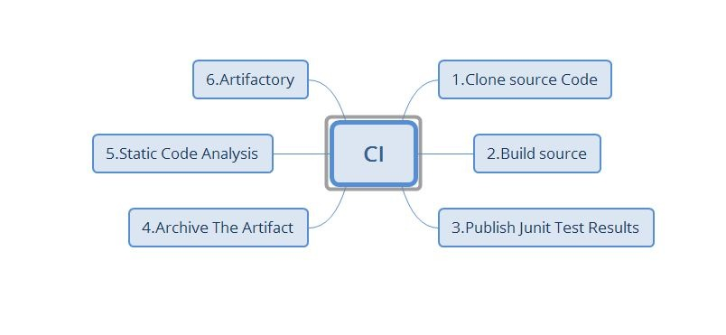
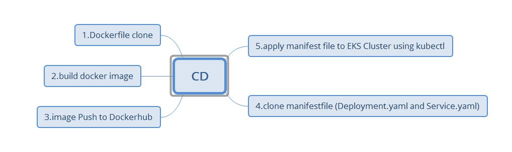

# __Continuous Deployment/Delivery__:
 ## Docker Job: Docker Slave 
  __write a Dockerfile and Push to Github__
   1. clone docker file 
   ```
   git clone url(Dockerfile)
   ```
   1. Build image 
   ```
   docker image build -t gol:1.0 .
   ```
   3 docker image push docker Hub (any remote registry)
   ```
   docker login -u username -p password
   docker tag gol:1.0 abbanapuri0445/gol:1.0
   docker push abbanapuri0445/gol:1.0 
   ```
 ## Kuberenets Job: K8s Slave
  __write manifest file(yourhubusername/verse_gapminder:firsttry) and Push to GitHub__
   1. clone manifest 
   ```
   git clone url
   ```
   1. apply the manifest file to Kuberenets master
   ```
    kubectl apply -f deployment.yaml
    kubectl apply -f Service.yaml
   ```

### CI:
  __CI stages , upto Jfrog artifactory__

### CD:
  __CD stages docker and K8S__
