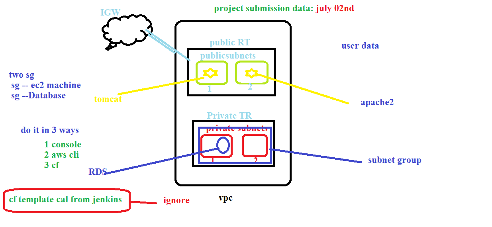

## AWS Network Project:
  1. create VPC
  2. create Internet gateway and attach to vpc
  3. create Route Table
  4. create Subntes
  5. Launch EC2 machine in Public subnet 
  * please follow below diagram
  
