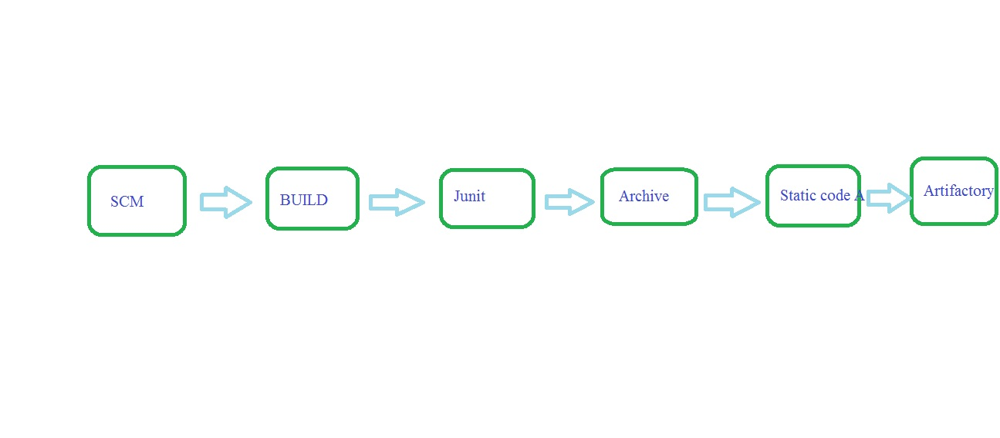

## stages:
   * clone source code
     ---
     git clone url
     ---
   * build code
     ---
     mvn package
     ---
   * Public Junit Test results 
   * Archive the Artifact
   * Static code analysis
   * Store artifacts into Jfrog
   
  